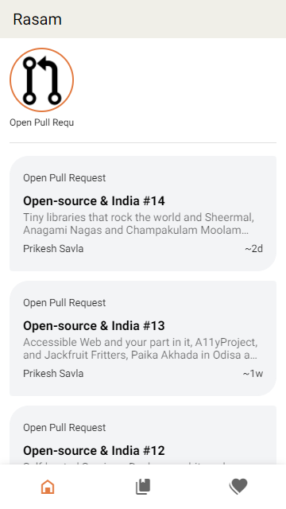
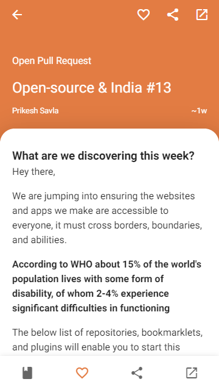
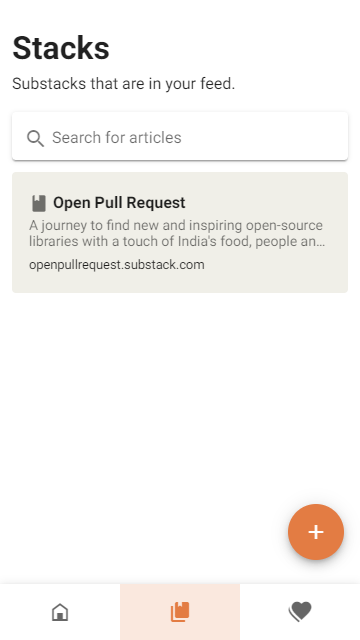
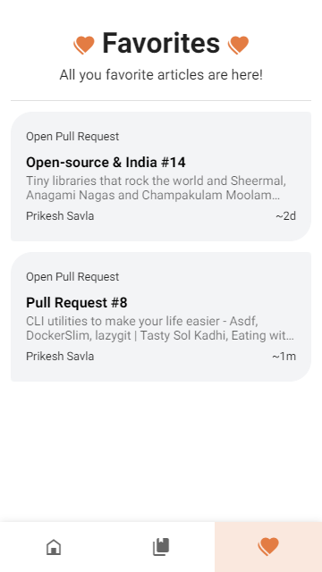

# Rasam

A Privacy focused and Offline enabled Feed Reader PWA with Nuxt, Nuxt PWA, Dexie

## Build Setup

```bash
# install dependencies
$ yarn install

# serve with hot reload at localhost:3000
$ yarn dev

# build for production and launch server
$ yarn build
$ yarn start

# generate static project
$ yarn generate
```

[](https://app.netlify.com/start/deploy?repository=https://github.com/prikeshsavla/rasam)

For detailed explanation on how things work, check out [Nuxt.js docs](https://nuxtjs.org).

| Home                           | Article                              |
| ------------------------------ | ------------------------------------ |
|  |  |

| Stacks                             | Favorites                                |
| ---------------------------------- | ---------------------------------------- |
|  |  |

### Roadmap V1

- [x] Display Feed like Twitter cards
- [x] Field to add new Feed
- [x] Open Article on tap
- [x] Favorite a article
- [x] Dispay Feed like stories
- [x] Added Infinite Scroll Paginations
- [x] Added Search with [Fuze.js](https://github.com/krisk/Fuse)

### Roadmap V2

- [x] Add Better Accessibility Support
- [x] Add Edit and Remove Feed Support
- [x] Upgrade RSS reading logic
- [x] Add Netlify Deploy tag and Link
- [ ] Add local AI option instead of Ollama
- [ ] Add Ollama support to summarize articles
- [ ] Sync 2 Apps To and From
- [ ] Export Data
- [ ] Add Multilingual Support
- [ ] Save data in local OPFS with sqlite or duckdb
